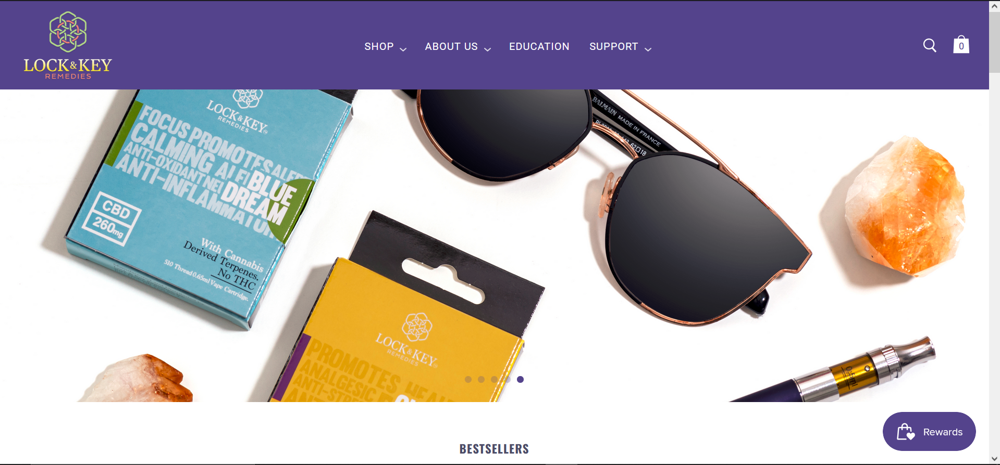

# Hi 👋, I'm Omar

<h3><a href="./resume.pdf">My resume 🔗</a></h3>

## A creative with a passion for building software applications

Combining my creative and technical passion to bring solutions for clients. As a software engineer I love to jump into new tools, and to be active in sharing my knowledege on any medium to this growing community! 

### Find me around the web 🌎
- Learning and teaching in public on [Twitch](https://www.twitch.tv/omifans_) 💻
- What I'm currently up to on [Twitter](https://twitter.com/digicoding) 🗣️
- Here is my [Website](https://omarest.dev/) 🔗
- My experience [LinkedIn](https://www.linkedin.com/in/omar-estevez/) 💼

## Languages

## Frameworks

 

## Backend

 

## Misc / Tools

## Design

# Work

<table align="left" bordercolor="#66b2b2">
  <tr>
    <td width="50%" valign="top">
      <h3 align="center">Lock & Key Remedies</h3>
         
        
         
      
Fully responsive Ecommerce website built for a company that create hollistic products for consumers.

    </td>
    <!-- <td width="50%" valign="top">
      <h3 align="center">MediumPhormat</h3>
         
      
         
        

    </td> -->
  </tr>
</table>

# Projects 
